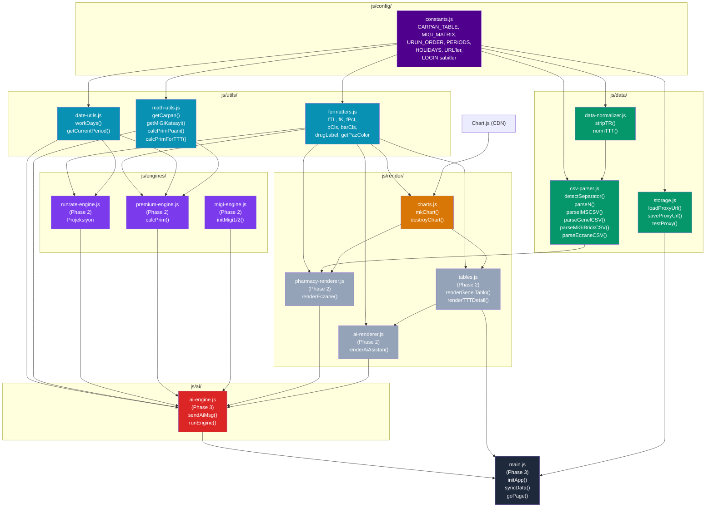

# Bağımlılık Haritası

## Efsane

| Renk | Katman | Phase |
|------|--------|-------|
| 🟣 Mor | Config | Phase 1 ✅ |
| 🔵 Mavi | Utils | Phase 1 ✅ |
| 🟢 Yeşil | Data | Phase 1 ✅ |
| 🟠 Turuncu | Render/Charts | Phase 1 ✅ |
| ⚫ Gri | Render/Tables | Phase 2 |
| 🟤 Mor açık | Engines | Phase 2 |
| 🔴 Kırmızı | AI Engine | Phase 3 |
| ⚫ Koyu | Main | Phase 3 |
